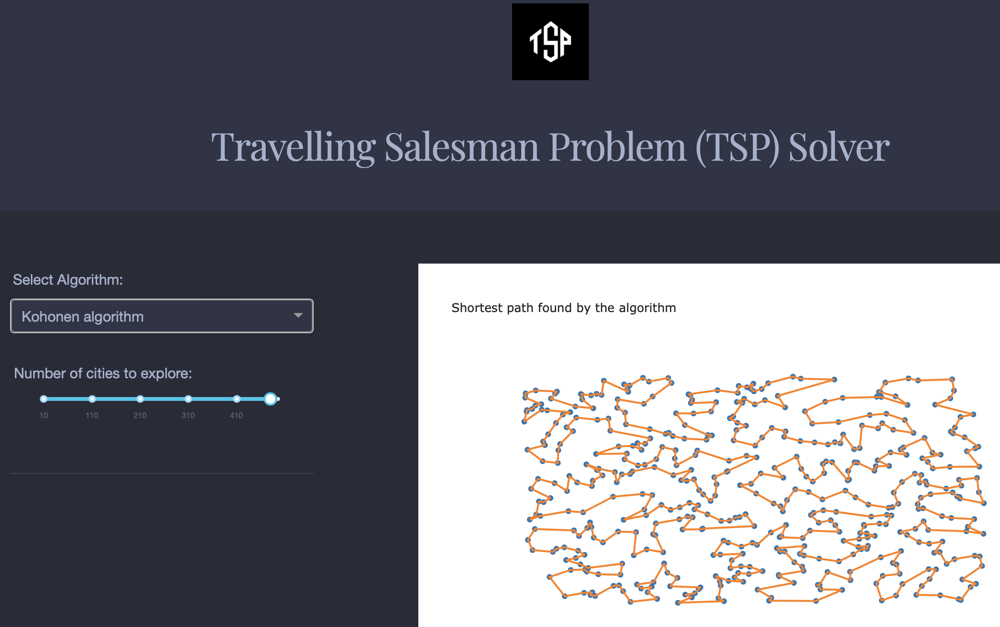

# Travelling Salesman Problem (TSP) Solver

This is an exploration app made using the Dash interactive Python framework developed by [Plotly](https://plot.ly/).

Dash abstracts away all of the technologies and protocols required to build an interactive web-based application and is a simple and effective way to bind a user interface around your Python code. To learn more check out the [documentation](https://plot.ly/dash).

Try out the [demo app here]




## Getting Started
### Using the demo
This demo lets you test your algorithm to resolve the Travelling Salesman Problem (TSP). 

It includes a few artificially generated datasets that you can modify by changing the sample size with the slider provided.

The other dropdown let you change the algorithm used to resolve the problem.

### Running the app locally

First create a virtual environment with conda or venv inside a temp folder, then activate it.

```
virtualenv dash-tsp-venv

# Windows
dash-svm-venv\Scripts\activate
# Or Linux and Mac
source venv/bin/activate
```

Clone the git repo, then install the requirements with pip
```
git clone https://github.com/Thomas-rnd/dash_TSP
cd dash-sample-apps/apps/dash-tsp
pip install -r requirements.txt
```

Run the app
```
python app.py
```

## Built With
* [Dash](https://dash.plot.ly/) - Main server and interactive components
* [Plotly Python](https://plot.ly/python/) - Used to create the interactive plots
